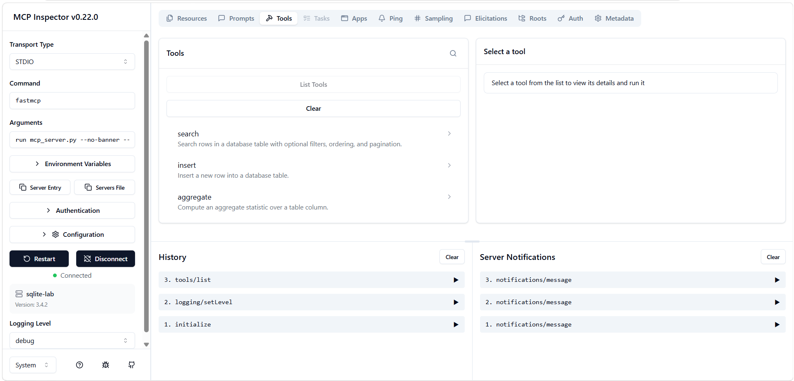
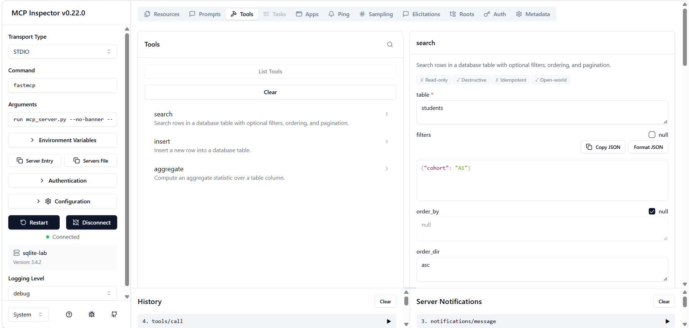
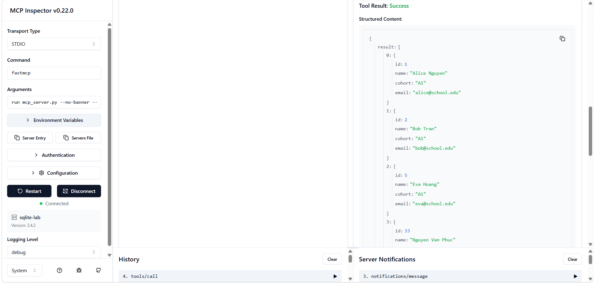
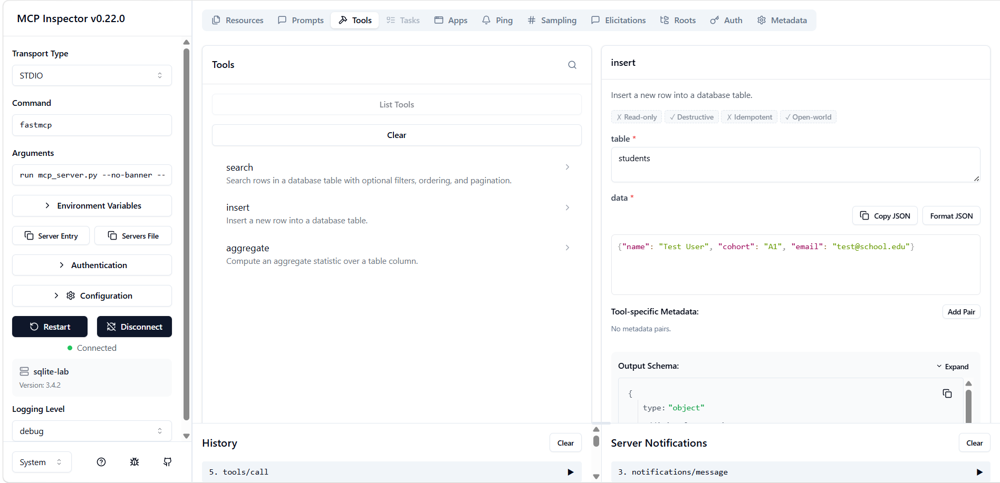
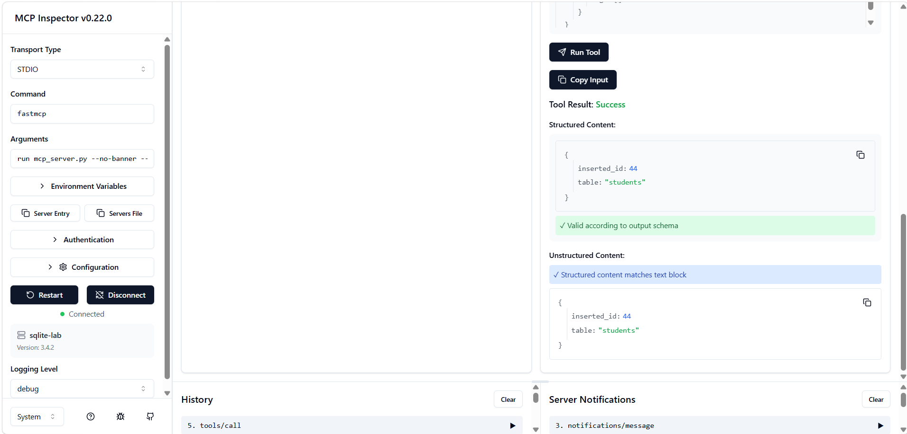
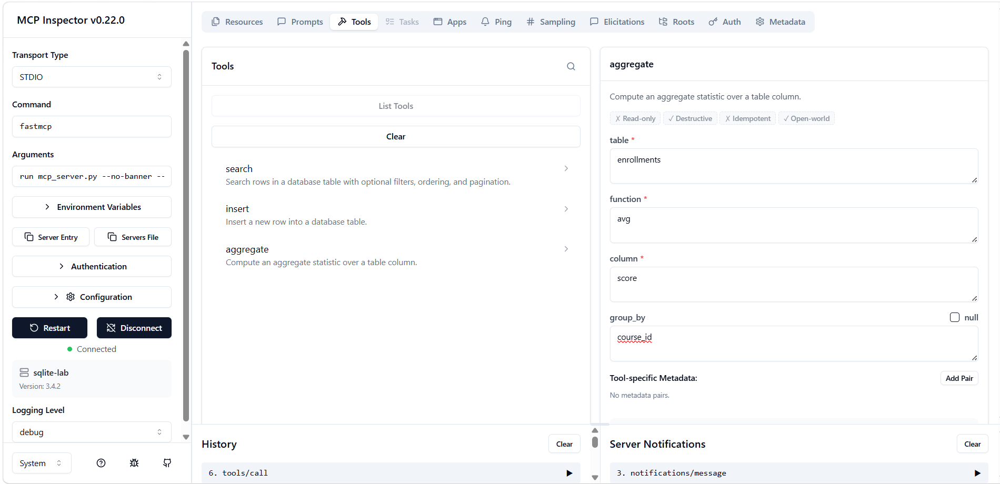
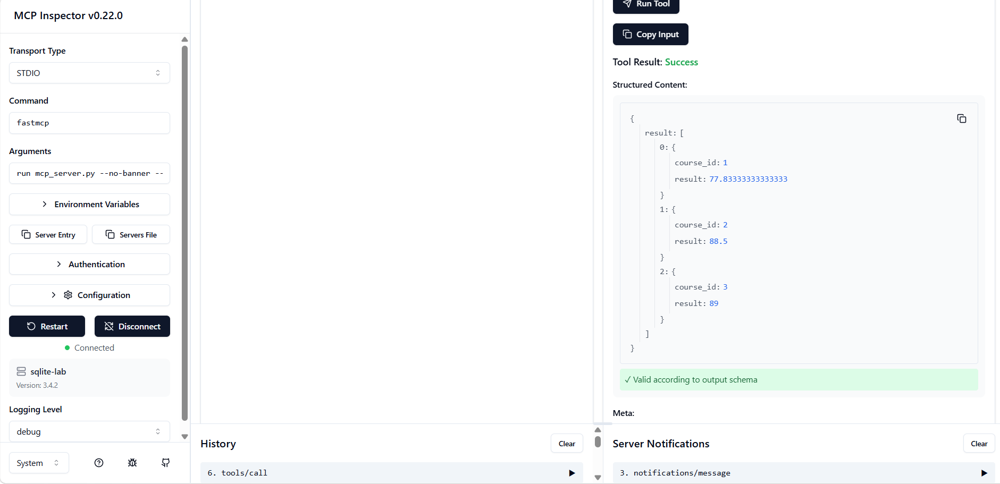
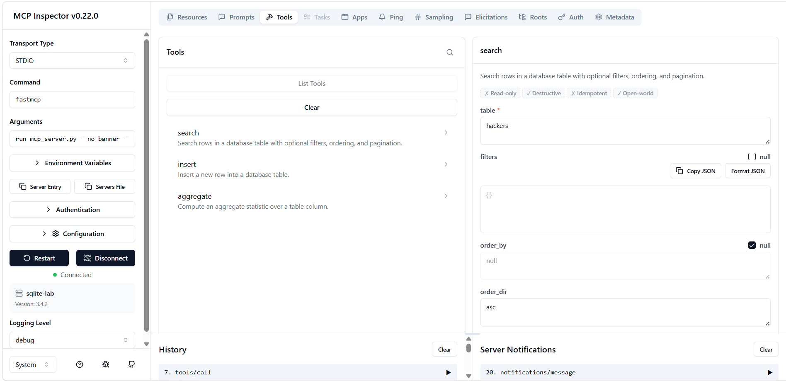
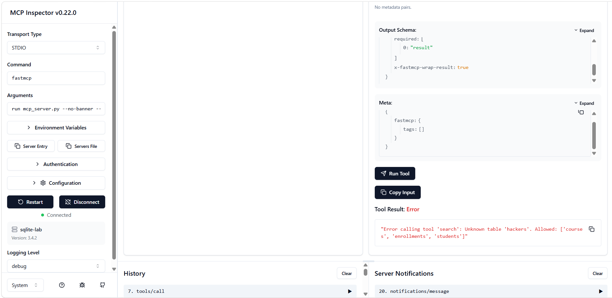

# SQLite MCP Server

A Model Context Protocol (MCP) server built with FastMCP and SQLite, exposing a school database through `search`, `insert`, and `aggregate` tools.

## Project Structure

```
implementation/
  db.py            # Database layer and validation
  init_db.py       # Create tables and seed data
  mcp_server.py    # FastMCP server (tools + resources)
  verify_server.py # Smoke test script
  requirements.txt
  tests/
    test_server.py # Automated pytest tests
```

## Data Model

| Table | Columns |
|---|---|
| `students` | id, name, cohort, email |
| `courses` | id, name, description |
| `enrollments` | id, student_id, course_id, score |

---

## Setup

### 1. Create and activate a virtual environment

```bash
python -m venv .venv
.venv\Scripts\activate        # Windows
source .venv/bin/activate     # macOS/Linux
```

### 2. Install dependencies

```bash
pip install -r requirements.txt
```

### 3. Initialize the database

```bash
python init_db.py
```

This creates `school.db` and seeds it with sample students, courses, and enrollments.

### 4. Start the server

```bash
python mcp_server.py
```

The server runs over stdio and is ready to accept MCP client connections.

---

## Test Steps

### Step 1 — Smoke test (all tools + resources + error cases)

```bash
python verify_server.py
```

Expected output: each check prints `OK` or `FAIL`. All checks should print `OK`.

### Step 2 — Automated unit tests

```bash
pytest tests/ -v
```

Expected output: 22 tests, all passing.

### Step 3 — MCP Inspector (visual verification)

From the project root (requires Node.js):

```bat
start_inspector.bat
```

Open the URL shown in the terminal (usually `http://localhost:5173`).

Inspector checklist:
- Tools `search`, `insert`, `aggregate` appear with correct schemas
- Resources `schema://database` and `schema://table/{table_name}` appear
- Valid tool call returns results
- Invalid tool call (e.g. unknown table) returns a clear error message

### Step 4 — Manual tool tests via Claude Code client

Add to `.mcp.json` at the project root (already present):

```json
{
  "mcpServers": {
    "sqlite-lab": {
      "type": "stdio",
      "command": "python",
      "args": ["D:\\2A202600539-NguyenVanPhuc-Day26-Track3\\implementation\\mcp_server.py"],
      "env": {}
    }
  }
}
```

Restart Claude Code — it will auto-connect to the server. Then run these prompts:

**search**
- *Search all students in cohort A1*
- *Search enrollments ordered by score descending, limit 5*

**insert**
- *Insert a new student named Nguyen Van Phuc in cohort A1 with email phuc@school.edu*

**aggregate**
- *Count all students*
- *Compute average score grouped by course_id*

**resources**
- `@sqlite-lab:schema://database`
- `@sqlite-lab:schema://table/students`
- `@sqlite-lab:schema://table/enrollments`

**error handling**
- *Search the table called hackers* → expected: unknown table error
- *Insert into students with a column called password* → expected: unknown column error
- *Compute median score in enrollments* → expected: unsupported function error

---

## Demo Screenshots

### Tools discovered in MCP Inspector


### `search` — input


### `search` — result


### `insert` — input


### `insert` — result


### `aggregate` — input


### `aggregate` — result


### Error handling — input


### Error handling — result


---

## Tools

### `search`
Search rows in a table with optional filters, ordering, and pagination.

```json
{
  "table": "students",
  "filters": { "cohort": "A1" },
  "order_by": "name",
  "order_dir": "asc",
  "limit": 10,
  "offset": 0
}
```

### `insert`
Insert a new row into a table.

```json
{
  "table": "students",
  "data": { "name": "Nguyen Van Phuc", "cohort": "A1", "email": "phuc@school.edu" }
}
```

### `aggregate`
Compute aggregate statistics over a column.

```json
{
  "table": "enrollments",
  "function": "avg",
  "column": "score",
  "group_by": "course_id"
}
```

Supported functions: `count`, `sum`, `avg`, `min`, `max`

## Resources

| URI | Description |
|---|---|
| `schema://database` | Full schema for all tables |
| `schema://table/{table_name}` | Schema for a single table |

---

## Quick Grading Questions

**1. Can I start the server and discover the tools?**

```bash
python mcp_server.py
```
Ask Claude Code: *What tools does sqlite-lab have?*
Expected: lists `search`, `insert`, `aggregate` with their parameters.

---

**2. Do `search`, `insert`, and `aggregate` all work?**

- *Search all students in cohort A1*
- *Insert a new student named Nguyen Van Phuc in cohort A1 with email phuc@school.edu*
- *Compute average score grouped by course_id*

---

**3. Can I read the schema resource and the per-table schema template?**

- `@sqlite-lab:schema://database`
- `@sqlite-lab:schema://table/students`
- `@sqlite-lab:schema://table/enrollments`

---

**4. Does the project reject bad input safely?**

- *Search the table called hackers* → error
- *Insert into students with a column called password* → error
- *Compute median score in enrollments* → error

---

**5. Is there a repeatable verification story?**

```bash
cd implementation
python verify_server.py   # smoke test — prints OK/FAIL for each check
pytest tests/ -v          # 24 unit tests
```

---

**6. Can at least one client actually use the server?**

`.mcp.json` is configured at project root. After restarting Claude Code, run any prompt above — if Claude responds with real database data, the client is working.
